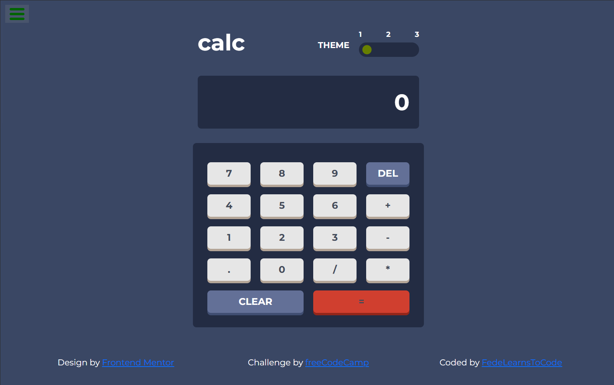

# Calculator app

A responsive and theme-switchable calculator built with **React**, styled using **CSS variables** and **Bootstrap**, developed to fulfill the [freeCodeCamp Front End Development Libraries Project](https://www.freecodecamp.org/learn/front-end-development-libraries/#front-end-development-libraries-projects), and its design is based on the [Calculator App challenge from Frontend Mentor](https://www.frontendmentor.io/challenges/calculator-app-9lteq5N29).

[Live Demo](https://fedelearnstocode.github.io/Calculator-app)

---

## 🛠 Features

- Fully functional calculator with basic arithmetic operations (`+`, `-`, `*`, `/`)
- Handles decimal inputs and negative numbers
- Operates using **formula logic** (i.e. follows operator precedence)
- Switch between **three visual themes** using a custom range slider
- Mobile-friendly layout using Bootstrap
- Clear (`RESET`) and delete (`DEL`) functionalities
- Operator correction: last valid operator is used in case of multiple

---

### ⚙️ Technologies Used

- **React 18** (via CDN)
- **Bootstrap 5** (for layout and responsiveness)
- **Custom CSS with CSS Variables** (for theme switching)
- **Babel** (to support JSX in browser)

---

## 💡 Technical Notes 

- To ensure that FreeCodeCamp's tests run correctly on GitHub Pages, I had to **embed the `app.js` logic directly inside the `index.html` file**.

---

## 🔗 Useful Links

- [freeCodeCamp Project Instructions](https://www.freecodecamp.org/learn/front-end-development-libraries/front-end-development-libraries-projects/build-a-javascript-calculator)
- [Frontend Mentor Design Challenge](https://www.frontendmentor.io/challenges/calculator-app-9lteq5N29)
- [React Documentation](https://reactjs.org/)
- [Bootstrap 5 Documentation](https://getbootstrap.com/docs/5.3/getting-started/introduction/)

---

🎓 Built for the project **Build a JavaScript Calculator** by [freeCodeCamp](https://www.freecodecamp.org).

